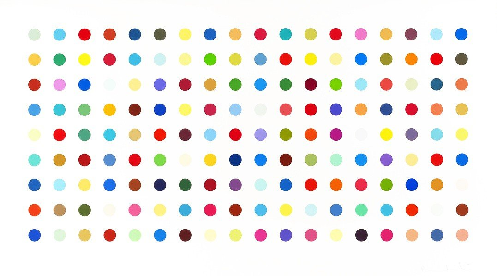

# **Hirst Painting Project**

## This project is based on a demo image of "Hirst Spot Painting" from Google.    
    
### **Libraries used:**  
 Colorgram (1.2.0), Turtle graphics  
 ### **Project:**  
 Hirst Painting Project  
 100 Days of Code - The Complete Python Pro Bootcamp 2021  
 Day 18 - Intermediate - Turtle & the Graphical User Interface (GUI)